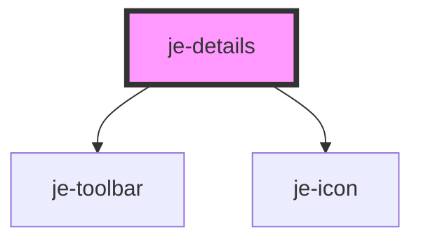

<!-- Auto Generated Below -->

## Properties

| Property     | Attribute     | Description | Type                | Default     |
| ------------ | ------------- | ----------- | ------------------- | ----------- |
| `iconSide`   | `icon-side`   |             | `"left" \| "right"` | `'right'`   |
| `iconToggle` | `icon-toggle` |             | `boolean`           | `false`     |
| `open`       | `open`        |             | `boolean`           | `false`     |
| `summary`    | `summary`     |             | `string`            | `undefined` |

## Events

| Event      | Description | Type               |
| ---------- | ----------- | ------------------ |
| `collapse` |             | `CustomEvent<any>` |
| `expand`   |             | `CustomEvent<any>` |

## Shadow Parts

| Part                  | Description |
| --------------------- | ----------- |
| `"content"`           |             |
| `"content-container"` |             |
| `"toggle"`            |             |

## Dependencies

### Depends on

- [je-toolbar](../je-toolbar)
- [je-icon](../je-icon)

### Graph

----------------------------------------------

