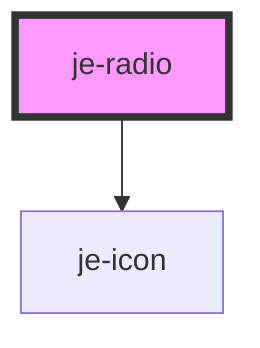

<!-- Auto Generated Below -->

## Properties

| Property   | Attribute  | Description                                                       | Type      | Default     |
| ---------- | ---------- | ----------------------------------------------------------------- | --------- | ----------- |
| `selected` | `selected` | If the option is currently selected                               | `boolean` | `undefined` |
| `value`    | `value`    | The value of this option and the radio group will compare against | `any`     | `undefined` |

## Dependencies

### Depends on

- [je-icon](../je-icon)

### Graph

----------------------------------------------

