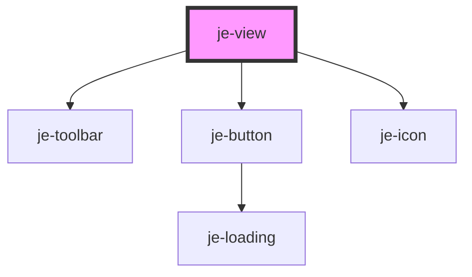

<!-- Auto Generated Below -->

## Properties

| Property   | Attribute  | Description | Type      | Default     |
| ---------- | ---------- | ----------- | --------- | ----------- |
| `closable` | `closable` |             | `boolean` | `true`      |
| `label`    | `label`    |             | `string`  | `undefined` |

## Shadow Parts

| Part      | Description |
| --------- | ----------- |
| `"label"` |             |

## Dependencies

### Depends on

- [je-toolbar](../je-toolbar)
- [je-button](../je-button)
- [je-icon](../je-icon)

### Graph

----------------------------------------------

